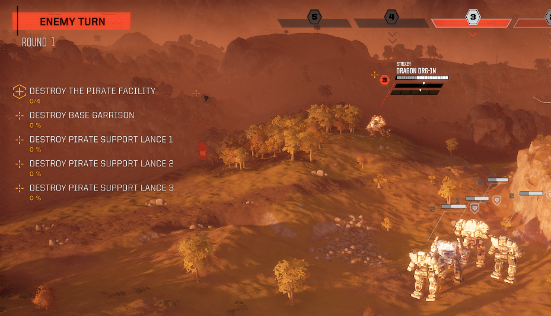

# Mission Control

A HBS BattleTech mod that provides a framework for runtime modifications of the contracts and encounters. This includes varying the encounter specifics such as spawn locations, lance numbers and objectives.

## Features

### Additional Lances

Additional enemy and ally lances will spawn based on contract type, biome type, percentage chances, maximum limits and lance configs.

For full configuration options, see the [Additional Lances](./docs/additional-lances.md) page.

### Random Spawns

Depending on the contract type, the lance spawns will change every playthrough. The spawning uses contract type specific logic to suitably place the lances. There are no configuration options currently available for this as these come from the encounter type rulesets that are created.

For full information on the random spawns, see the [Random Spawns](./docs/random-spawns.md) page.

### Contract Type Rulesets

Mission Control allows other modders to add their own contract type rulesets to be used. When added to the mod, the mod will randomly select a ruleset for a contract type from the given choices.

**This is experimental and not yet fully supported. This system will change and it is _not_ recommended you build on this system yet.**

For full information on contract type rulesets, see the [Contract Type Rulesets](./docs/contract-type-rulesets.md) page.

## Roadmap

This roadmap contains features that may not make it into the mod. It depends on the technical feasibility of the feature.

| Feature | Expected Version | Status  |
| ------- | ---------------- | ------- |
| Encounter Objective - Defend X Units | Unknown | :heavy_minus_sign: |
| Encounter Logic - Lance Faction Change | Unknown | :heavy_minus_sign: |
| Random Spawn - Buildings | Unknown | :heavy_minus_sign: |
| Random Spawn - Plots | Unknown | :heavy_minus_sign: |
| Additional Lances - Player Lances | Unknown | :heavy_minus_sign: |
| Reuse Maps - Story - 1B Retreat | Unknown | :heavy_minus_sign: |

...many more to be added soon.

## Feedback

All feedback is welcome in the [issues section](https://github.com/CWolfs/MissionControl/issues).

## Author

Richard Griffiths (CWolf)
  * [Twitter](https://twitter.com/CWolf)
  * [LinkedIn](https://www.linkedin.com/in/richard-griffiths-436b7a19/)