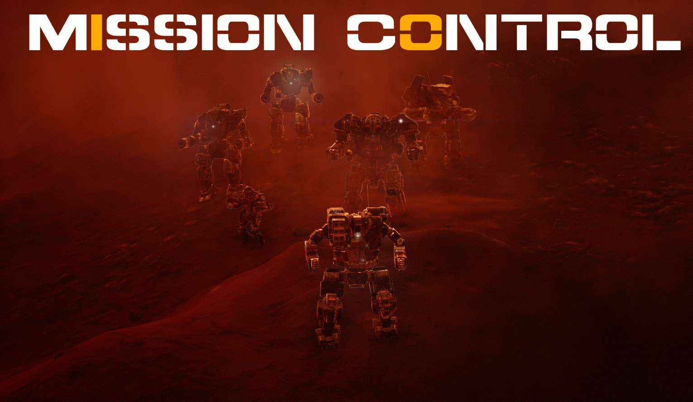

# Mission Control

A HBS BattleTech mod that provides a framework for runtime modifications of the contracts and encounters. This includes varying the encounter specifics such as spawn locations, lance numbers and objectives.

This works only for the generic contract types (e.g. Battle, Rescue etc) as it would break the balance for vanilla story missions.

## Videos

- [Release Trailer](https://www.youtube.com/watch?v=MGPrebHW0R0)
- [Additional Lances Tutorial](https://www.youtube.com/watch?v=srvqUjdeESk)

## Installation

- Download the [latest release](https://github.com/CWolfs/MissionControl/releases)
- Unzip the release into your ModTek `Mods` folder
- Enjoy!

## Features

- Additional Lances (AI Controlled Enemy & Allies) | [Documentation](./docs/additional-lances.md)
- Random Lance Spawns (Appropriate for Contract Type)
- Extended Boundaries (Bigger Maps - sometimes up to 4 times as big!) | [Documentation](./docs/extended-boundaries.md)
- Extended Lances (Clan Stars [5 units], Level-II Lances [6 units]) | [Documentation](./docs/extended-lances.md)
- Dynamic Withdraw
- New AI Behaviours
- Single Player Skirmish with Quick Skirmish (Bypass Skirmish Menus)
- Encounter Rulesets (New Game Logic for Contract Types) | [Documentation](./docs/encounter-rulesets.md)
- New Combat Dialogue

## Important Notes

- Mission Control does not work with in-combat saves. Finish your contract first (or restart it).

## Full Description

### Additional Lances

Additional enemy and ally lances will spawn based on contract type, biome type, faction reputation, allies/enemies, percentage chances, maximum limits and lance configs.

For full configuration options, see the [Additional Lances](./docs/additional-lances.md) page.

### Random Spawns

Depending on the contract type, the lance spawns will change every playthrough. The spawning uses contract type specific logic to suitably place the lances. There are no configuration options currently available for this as these come from the encounter type rulesets that are created. Which things are randomised in the game is determined by the `Encounter Ruleset` which is run for that contract type.

### Bigger Maps

Increase the size of the encounter to the maximum available map size. This can sometimes be as much as around four times the size!

### Extended Lances

Increase the sizes of lances where it makes sense. For the vanilla game this does nothing. If another mod is using Mission Control, then they can set Clan stars (5 mechs) or Comstar Demi-lances / Reinforced lances (6 mechs).

This works for both vanilla spawn points for contract types and spawns created by Mission Control.

### Dynamic Withdraw

When being forced to withdraw and extraction zone appears for you. You must extract there before you can end the mission. Plan your escape accordingly.

### Ally Combat Dialogue

When dropping with your allies they will break radio silence to inform you of the current situation, show their joy at your arrival or generally complain they are fighting with dirty Mercs.

### New AI

Completely new AI behaviours that do not exist in the vanilla game.

- Follow Lance - Follows the heaviest mech in the target lance. Favours the lance order when finding multiple mechs of the same tonnage.

### Single Player Skirmish Support with Quick Skirmish Feature

Mission Control works on single player skirmish if a contract type ruleset is created for it, or the 'DebugSkirmishMode' option is turned on (defaults to on).

The 'Quick Skirmish' feature adds a new main menu button. When clicked it will use the last lance the player used for the cost brackets (unlimited selected first and clash last) then it gives the player a random map and mood. It will spawn the player lance and the enemy lance within firing range. This is ideal for modders testing their mods or people who want a very quick skirmish.

### Encounter Rulesets

Mission Control allows other modders to add their own contract type rulesets to be used. When added to the mod, the mod will randomly select a ruleset for a contract type from the given choices.

**This is experimental and not yet fully supported. This system will change and it is _not_ recommended you build on this system yet.**

For full information on contract type rulesets, see the [Encounter Rulesets](./docs/encounter-rulesets.md) page.

## Roadmap

For a glimpse into the future of Mission Control check out the milestones, for example [v0.4.0](https://github.com/CWolfs/MissionControl/milestone/6), and the [issues section](https://github.com/CWolfs/MissionControl/issues).

## Feedback

All feedback is welcome in the [issues section](https://github.com/CWolfs/MissionControl/issues).

## Special Thanks

I wouldn't have completed such an ambitious mod without the support and help of the modding community. Sorry if I miss anyone out as so many people have helped in their own way. In no particular order,

- Eck
- Morphyum
- jo
- LadyAleko
- akodoreign
- bloodydoves
- GentlePayload
- gnivler
- TekGnosis
- ...and everyone in the modder channels at BATTLETECHGAME discord who helped in lots of different ways!

## Author

Richard Griffiths (CWolf)

- [Twitter](https://twitter.com/CWolf)
- [LinkedIn](https://www.linkedin.com/in/richard-griffiths-436b7a19/)
